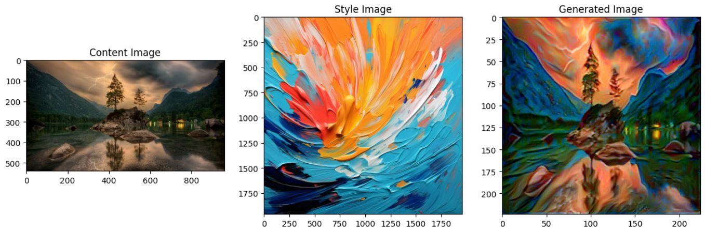
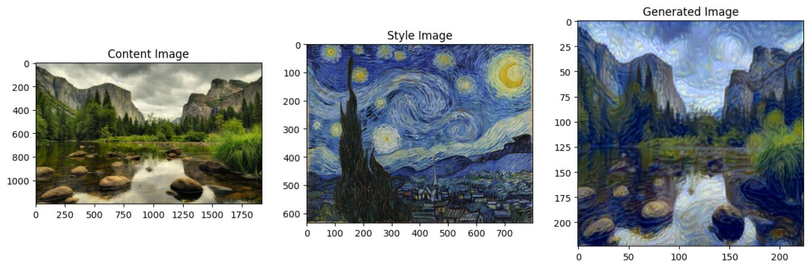

# Neural Style Transfer

## Overview

This project implements Neural Style Transfer (NST), based on the original paper by Gatys et al., and extends it to apply style transfer to video sequences. The goal is to transfer the artistic style from a style image onto the content of a video, creating visually appealing and unique video transformations.

## Demo Video

## Original Paper

The implementation is based on the following paper:

*   **Image Style Transfer Using Convolutional Neural Networks:** [https://arxiv.org/abs/1508.06576](https://arxiv.org/abs/1508.06576) by Gatys et al.

## Sample Results

Here are a few sample results of the style transfer applied to images:

### Image 1

  

### Image 2

  
